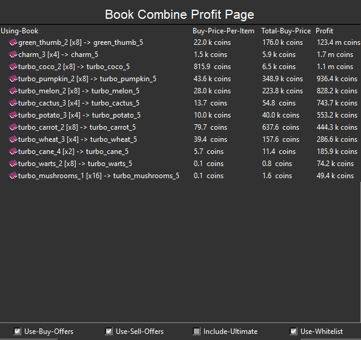

## Features
### 1. Mayor Info

---
View the active Mayor, his active perks and the remaining time.

 
### 2. Active Flips

---
Keep track about your investments over time. \
Either if you maybe bought cheap item and want to track when to sell them (brown). \
Or the items were farmed, which means that no money was spent, meaning the profit is higher (dark green).
Click on a colored field to edit or view the individual prices (image below).

 

Purchases for different prices can be entered in the software. \
This is useful when purchasing by order, for example.

 

### 3. Advanced Bazaar flipping

---
This is an advanced Bazaar flipping tool, with several options. \
(The current Average price can be requested by right-clicking ab item. \
This is the only way to update the average prices.)
* Green: Buy oder price is below the average of the last week.
* Red: Buy oder price is above the average of the last week.
* Cyan: Most likely a price crash. (Price gets very low)
#### Features
* Search for specific items.
* Show / hide Flip-Rating (calculated from profit per flip and buys / sells per hour)
* Change display to show different amounts.
* toggle enchantment include (some enchantments are hard to flip)
* Filter most likely manipulated Data
* Option to hide item with an insta-sell rate < 1 per hour.
* Display average price.
* Display buy / sell offers
* Display buys / sells per day / hour / week
* Double click item to open price Graph

 

 

### 4. Bazaar Craft Profit

---
Calculates craft profit. Buying ingredients from the Bazaar and sell the result.

 

### 5. Bazaar to Auction House Flip Profit

---
Calculate the profit from crafted items sold to the Auction House. 
 

### 6. Auction House

---
View all active auctions. 

#### Features
* filter BIN or Auction
* filter rarity
* filter pet prices (second image) (and yeah Squid [Lvl.29] is the cheapest :) )
* view your own auctions and from your mates (add all uuids in settings GUI)

 
 
 

### 7. Magic-Find Calculator

---
Note: This feature does not work correct currently due a wrong formular from the WIKI. \
Used to calculate how many kills / actions have to be done to drop an item / pet.

 

### 8. Pest Profit

---
Tool to calculate pest profit based on Farming-Fortune, Crop-Fortune and Pet-Luck.

 

### 9. Alchemy XP Calculator

---
Calculate the cost to increase the alchemy-level based on wisdom. \
Level range can be set using the 'Level-Range' entry. \
Or a single number can be inserted to calculate only this level. \
The coin reward from reaching alchemy levels is also included in price! \
You can change the 'Default' to use sulfur to save even more coins.

### 10. Composter Profit

---
Calculate composter profit based on Plant-Matter type, Fuel type and Composter-Upgrades. \
View offline profit (full composter).

### 11. Cheapest book craft

---
Note: This can be wrong is a book is NOT combinable. \
View the best books to buy to get the required book.

### 12. Book Combine Profit

---
Buy books, combine them and sell the result. \
This tool calculates witch books to buy. \
There is a toggleable whitelist with the important books.

